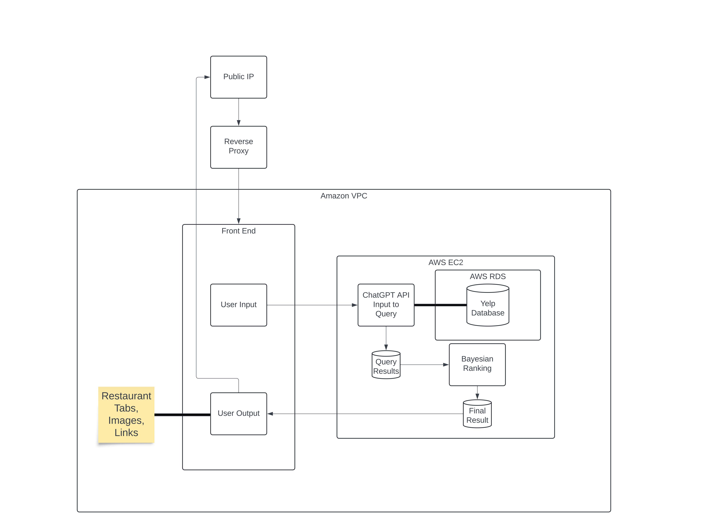

## Architecture Diagram

## Flow Explanation

The architecture diagram illustrates the flow of our system:

- **Component A**: Description of Component A and its role in the system.
- **Component B**: Description of Component B and its interaction with Component A.
- **Component C**: Description of Component C and how it interacts with Components A and B.
- Etc.

[Download PDF](MunchArchitectureDiagram.pdf)
