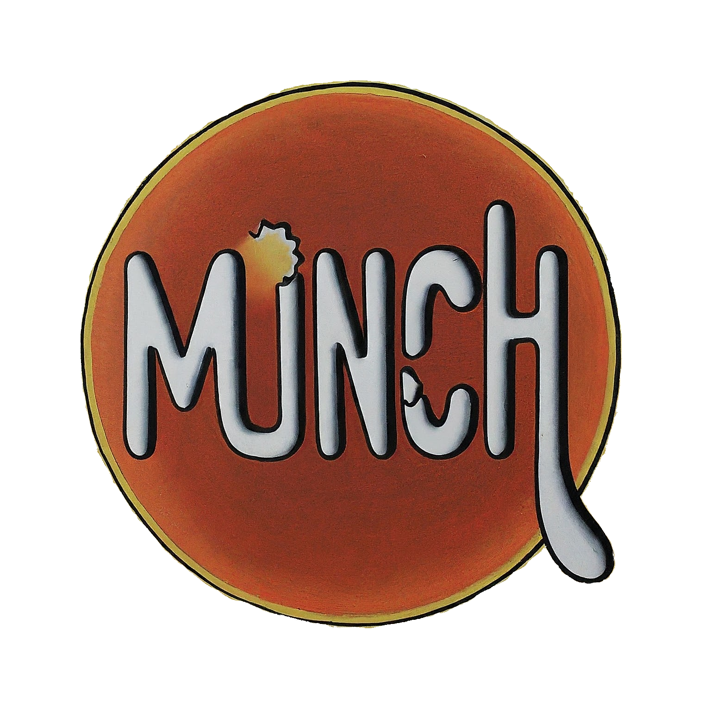

# Munch

Welcome to Munch - your go-to destination for smart, conversational restaurant searching! Whether you're gluten free or just want to find the best burger in town, Munch will be your new foodie friend.

## About Envitas

Envitas is a dynamic project group passionate about bringing innovation to the sneaker community. Our team consists of:

- Jeffrey Taylor
- Topher Roebuck
- Cholyeon Cho
- Gabriel Munhoz
- Mike Yu

## Elevator Pitch

Munch is a revolutionary iOS app that will make searching for a bite to eat easy and enjoyable. With the help of our LLM-powered AI chatbot, you won't have to endlessly scroll through reviews, websites, or the musings of local guides to find the perfect restaurant that fits your needs. Simply tell Munch what you're looking for, and it will provide relevant options near you with a friendly, conversational tone. Munch will save you from stress and hassle, so you can focus on what matters most: good food and good times.

## Features

- **Interactive AI Chatbot**: Get personalized assistance in your search for a meal with our LLM-powered chatbot.
- **Advice based on relevant reviews**: Munch will do the hard work so you don't have to. Answers are powered by real reviews! Munch filters out the noise, so you can trust you're getting good information.
- **Transparent information**: Ultimately, you still have a decision ahead, so Munch will provide users with overall ratings, location, and any other available restaurant characteristics.  

## Getting Started

To get started with Munch, simply download our app and create an account. Once logged in, you'll have access to all of our AI helper and all the restaurant data we have available.

## Contributing

We welcome contributions from the community! If you have ideas for improvements or new features, feel free to submit a pull request.

## Contact Us

If you have any questions or feedback, don't hesitate to reach out to us:

- Email: [contact@MunchAI.com](mailto:contact@MunchAI.com)
- Twitter: [@MunchAI](https://twitter.com/MunchAI)
- Instagram: [@Munch_Official](https://instagram.com/Munch_official)

## License

This project is licensed under the MIT License - see the [LICENSE](LICENSE) file for details.
